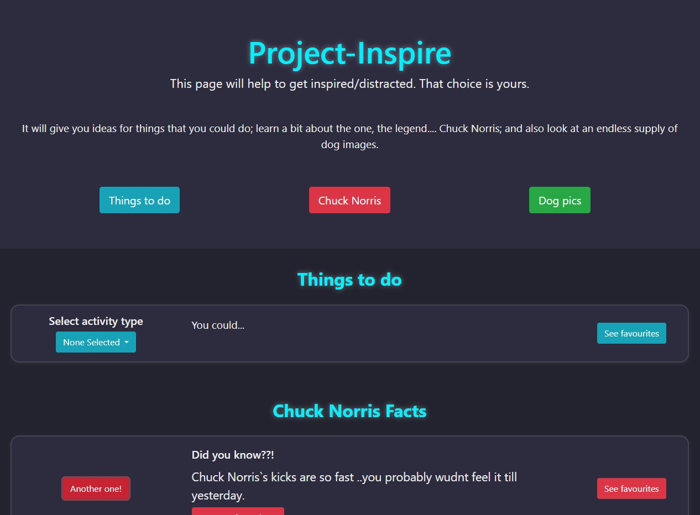

# Project-inspire

## Description

Are you tired of not knowing what to do? Are you dying to learn some facts about Chuck Norris? Or are you wishing to look at an endless supply of dog images? Worry not folks, Project Inspire can do all these things.

## Usage

The deployed application can be accessed on: https://shootlessdie.github.io/project-inspire/

And it looks like this.

    

## Presentation

The recorded presentation of the project can be found on this link: https://youtu.be/3_G8A7yxD_A

And the presentation itself through here: https://docs.google.com/presentation/d/1b5vyFGRAhW-KgR5g_CfPkZ4TGRFBeWul10PjuzkYUJY/edit?usp=sharing

## License

This project is licensed under the MIT-License.
